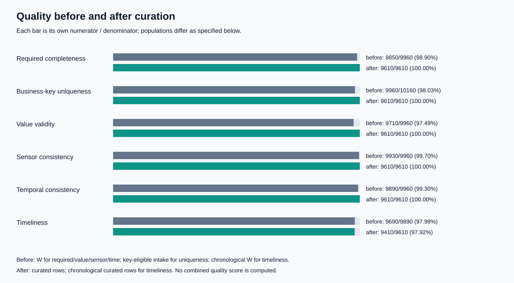

# LAB 2 — DATA CURATION, QUALITY & METADATA GOVERNANCE

Báo cáo kết quả thực thi trên tenant **bd-g10**. Thời điểm hoàn thành curation: **10/10/2026 22:41:39 UTC+7**. Dữ liệu là fixture tổng hợp `research-telemetry-v1`; thời điểm đánh giá dữ liệu cố định là **2026-02-09T00:00:00Z**, độc lập với thời gian thực thi.

## Thành viên và phân công

| MSSV | Họ tên | Vai trò | Phạm vi kỹ thuật | Đối chiếu chéo |
|---|---|---|---|---|
| 24022306 | Nguyễn Tùng Dương | A | Ingestion | Role D |
| 24022466 | Lê Toàn | B | Quality | Role C |
| 24022463 | Đàm Quang Tiến | C | Curation | Role A |
| 24022277 | Lê Ngọc Minh Cường | D | Metadata | Role E |
| 24022484 | Trần Anh Tuấn | E | Release | Role B |

## Kết quả tổng thể

Pipeline thu nhận đủ bốn đối tượng qua S3, kiểm tra số byte và SHA-256 bằng manifest tin cậy được cấp riêng. Hai nguồn quan sát có **10.205** bản ghi vật lý. Kết quả phân hoạch là **9.610 curated + 395 quarantine + 200 duplicates = 10.205**. Không thiếu ID vật lý, không sinh ID mới, không giao nhau giữa ba đầu ra và không lặp ID vật lý trong một đầu ra. Tất cả 9.610 khóa nghiệp vụ trong curated là duy nhất.

Candidate qua cả **G01–G09**; harness cho kết quả **1 PASS và 7 REJECT**, đúng **8/8** kỳ vọng. Chủ thể `s3-owner` thực hiện đánh giá kỹ thuật trong Pod publisher riêng, tải các đối tượng đã duyệt lên prefix mới và ghi manifest cuối cùng. Chủ thể `s3-analyst` đọc đúng bản phát hành, kiểm tra checksum và đếm lại **9.610** dòng. Raw GET của analyst và release PUT của curator đều nhận **HTTP 403 / AccessDenied** thực tế.

## T1 — Snapshot và hợp đồng dữ liệu

Hai nguồn lần lượt là `observations_a.csv` (**5.000** bản ghi) và `observations_b.jsonl` (**5.205** dòng); registry có **20** cảm biến, QA có **100** ID tham chiếu. Snapshot trong `restricted/snapshot/` giữ nguyên byte đầu vào. Manifest tin cậy được mount chỉ đọc ở `/trusted/trusted_manifest.json`, tách khỏi manifest tiện ích đi kèm dữ liệu. `input_inventory.json` ghi bucket/key, định dạng, thời điểm thu nhận, số bản ghi, số byte và SHA-256 cho cả bốn file.

CSV dùng các tên canonical; JSONL ánh xạ `id→record_id`, `sensor→sensor_id`, `timestamp→event_time`, `arrived_at→ingest_time`, `temperature→reading`, `temperature_unit→unit`, `operator→operator_email`. ID vật lý là `(source_object, source_row)`: ordinal CSV không tính header; JSONL dùng số dòng bắt đầu từ 1. **5 dòng JSON lỗi vẫn có envelope** với `parse_ok=false`, được cách ly với lý do PARSE. Envelope check xác nhận không lặp khóa vật lý.

Hợp đồng được cố định trước đo chất lượng: trim/uppercase ID và unit, timestamp UTC đúng định dạng, khóa `R[0-9]{6}`, đơn vị C/F, giá trị hữu hạn, khoảng **[−30,60] °C**, `event≤ingest≤AS_OF`, ngưỡng trễ **900 giây**, và ngưỡng phát hành không thay đổi sau mutation. Hash hợp đồng: `c5be4371036fc51d0688fd676e6d85b463404536f3ee11c10ec0838626862520`. Một byte của bản sao dùng riêng cho thử nghiệm bị đổi; verifier từ chối INPUT_INTEGRITY và snapshot gốc vẫn giữ hash ban đầu.

## T2 — Quần thể đo và kết quả chất lượng

Quần thể W trước curation gồm **9960 phiên bản thắng**, sau loại lỗi parse/khóa/arrival và trước lọc tính hợp lệ của winner. Uniqueness trước dùng **10160 bản ghi key-eligible**, không dùng W. Timeliness chỉ đo các bản ghi có chronology hợp lệ; trước curation có **70 winner** bị loại khỏi mẫu số riêng của chỉ số này. Parsed intake có **130** bản ghi thiếu trường bắt buộc; đây là thống kê intake, không thay thế mẫu số W.

| Chỉ số | Trước: tử số/mẫu số | Trước (%) | Sau: tử số/mẫu số | Sau (%) | Ngưỡng sau |
|---|---:|---:|---:|---:|---:|
| Đầy đủ trường bắt buộc | 9850/9960 | 98.8956% | 9610/9610 | 100.0000% | 100% |
| Duy nhất khóa nghiệp vụ | 9960/10160 | 98.0315% | 9610/9610 | 100.0000% | 100% |
| Hợp lệ giá trị | 9710/9960 | 97.4900% | 9610/9610 | 100.0000% | 100% |
| Nhất quán cảm biến | 9930/9960 | 99.6988% | 9610/9610 | 100.0000% | 100% |
| Nhất quán thời gian | 9890/9960 | 99.2972% | 9610/9610 | 100.0000% | 100% |
| Kịp thời | 9690/9890 | 97.9778% | 9410/9610 | 97.9188% | 95% |
| Bao phủ QA | Không đo trước | — | 100/100 | 100.0000% | 100% |
| Đồng thuận QA | Không đo trước | — | 95/100 | 95.0000% | 95% |

Các metric JSON lưu rule ID, dataset version/run ID, cohort, numerator, denominator, value, threshold, severity và observed status. NULL được tính là thất bại với điều kiện bắt buộc; mẫu số bằng 0 mang trạng thái NOT_EVALUATED. Không tính trung bình các chiều chất lượng thành một điểm tổng hợp.

Theo bản ghi vật lý, tỷ lệ giữ lại là **94.1695%**, cách ly **3.8707%**, phiên bản bị thay thế **1.9598%**. Điểm completeness tăng do loại winner lỗi, không phải phục hồi hay điền giá trị thiếu. **200 bản ghi muộn vẫn được giữ**, nên timeliness sau là **9.410/9.610 = 97.9188%**. QA coverage là 100/100 và agreement là 95/100 trong dung sai **0,05 °C**; năm bất đồng được giữ vì QA chỉ phục vụ đánh giá, không tham gia sửa số đo.

## T3 — Curation và phân loại lỗi

Thứ tự xử lý là: cách ly parse lỗi; cách ly khóa lỗi/ingest không parse được; chọn phiên bản; kiểm tra winner; xuất ba đầu ra. Winner là arrival lớn nhất, hòa thì `source_object ASC`, sau đó `source_row ASC`. Nếu winner mới không hợp lệ, winner vào quarantine và bản cũ vào ledger SUPERSEDED; không lấy bản cũ thay thế. Sensor registry cung cấp site; QA reference không cung cấp nhiệt độ cho phép biến đổi.

| Lý do chính | Số bản ghi |
|---|---:|
| REQUIRED | 110 |
| NUMERIC | 60 |
| RANGE | 40 |
| TIME_PARSE | 40 |
| UNIT | 40 |
| REFERENCE | 30 |
| TIME_ORDER | 30 |
| INGEST_PARSE | 20 |
| KEY | 20 |
| PARSE | 5 |

Ít nhất ba nhóm lỗi được điều tra bằng count và source reference trong `quality_after.json`: REQUIRED do trường bắt buộc trống; NUMERIC do chuỗi không chuyển thành số hoặc số không hữu hạn; UNIT do đơn vị không được hỗ trợ. RANGE, TIME_PARSE, TIME_ORDER và REFERENCE được ghi riêng. Một dòng có thể có nhiều lý do trong `all_reasons`; bảng dùng `primary_reason` theo hợp đồng để các nhóm tổng cộng đúng 395.

Replay thực hiện bằng thứ tự nguồn đảo ngược và envelope xáo trộn có seed **24022463**, giữ nguyên source ordinal. Ba digest logic của curated/quarantine/duplicates đều bằng lần gốc. So sánh dùng projection sắp xếp canonical; không tuyên bố Parquet luôn có cùng byte khi thay writer/layout. File SHA-256 vẫn được dùng để kiểm tra đối tượng tải lên.

Fixture riêng xác nhận đủ bốn counterexample: **32 °F→0,00 °C**; K/NaN bị cách ly; email tùy chọn trống vẫn giữ và cột bị bỏ khỏi release; winner mới 100 °C bị cách ly trong khi bản cũ bị supersede. Ba kiểm tra bổ sung xác nhận giữ dữ liệu muộn, timestamp UTC nghiêm ngặt và lưu đồng thời KEY/INGEST_PARSE.

Schema Parquet thực đo có đúng mười cột:

| Cột | Kiểu | Ý nghĩa |
|---|---|---|
| record_id | VARCHAR | Normalized business observation identifier |
| sensor_id | VARCHAR | Normalized sensor identifier used to join the registry |
| site | VARCHAR | Site derived exclusively from sensors.csv |
| event_time_utc | TIMESTAMP | Measurement time, interpreted in UTC |
| ingest_time_utc | TIMESTAMP | Recorded arrival time, interpreted in UTC |
| temperature_c | DECIMAL(8,2) | Selected observation converted to Celsius; validated before rounding |
| is_late | BOOLEAN | True when recorded arrival lag exceeds 900 seconds |
| source_object | VARCHAR | Restricted input object identifier; does not grant access |
| source_row | BIGINT | One-based physical data-record ordinal; CSV header excluded |
| source_sha256 | VARCHAR | SHA-256 of the complete original source object |

`operator_email` và `raw_payload` không có trong schema phát hành. Email tổng hợp có thể nằm trong raw payload hạn chế; chúng không xuất hiện trong báo cáo chung hay nội dung GitHub của từng vai trò.

## T4 — Catalog, lineage và retention

Catalog có ba dataset: raw observations (**10.205**), quarantine (**395**) và curated candidate (**9.610**). Metadata lấy schema/count/nullability từ query thực; owner/steward là vai trò được phân công của nhóm. Profile schema được tăng cường theo Appendix E2 để location là mảng URI và columns bắt buộc đủ name/type/unit/nullable/meaning; file schema được cấp ban đầu vẫn được giữ để truy vết thay đổi. Validator kiểm tra cấu trúc và publisher kiểm tra số dòng, schema, hash, location, quality counters, cutoff và run identity.

M01 tìm curated có Celsius và quality-report link; M02 trả raw/quarantine với chính sách hold/dependency. M03 lấy năm câu trả lời từ bộ catalog, README và manifest của bản phát hành trong consumer context: đơn vị Celsius; mẫu QA 100 ID; cutoff cố định; giới hạn fixture/late/sample accuracy; liên hệ metadata steward. Đây là kiểm tra tự động, không giả lập lời xác nhận của một sinh viên.

`lineage.jsonl` chứa curate START/COMPLETE và publish START/COMPLETE với hai UUID độc lập. START/COMPLETE curation dùng UUID **ebf648b9-1e3f-47a5-87f1-e0e8924005b4**; publish dùng **32ce3332-6804-4e66-b2e9-19899af64171**. Events được kiểm tra bằng OpenLineage 2-0-2 chính thức đã cache và bằng semantic checks của lab. Các ca mutation có audit riêng gồm START và trạng thái cuối COMPLETE/ABORT tương ứng; không có approved manifest của ca bị từ chối.

Trace được lưu trong `evidence/traces.json` và `code/trace_queries.sql`. Dòng chấp nhận **R000381** trỏ tới `s3://research-raw/lab2/inputs/batch-01/observations_a.csv`, ordinal **381**, hash đối tượng và version rank 1. Dòng cách ly trỏ tới `s3://research-raw/lab2/inputs/batch-01/observations_a.csv`, ordinal **1**, lý do **REQUIRED**. Kiểm tra chéo đọc lại nguồn theo ordinal và tính SHA-256 riêng, không chỉ nhìn sơ đồ lineage.

Retention: raw **30 ngày từ retrieval**, quarantine **7 ngày từ run completion**, release **90 ngày từ publication**; audit/manifests ít nhất bằng đời release. Hold và active release dependency ghi đè eligibility xóa. Bốn dry-run lần lượt cho **ELIGIBLE/EXPIRED**, **KEEP/HOLD**, **KEEP/ACTIVE_DEPENDENCY**, **KEEP/NOT_EXPIRED**. Không xóa đối tượng thật; clock retention dùng thời điểm vận hành, không dùng AS_OF của fixture.

## T5 — Release gate và consumer

G01 kiểm tra input/staging integrity; G02 đối chiếu count/tập ID; G03 schema allowlist; G04 required/source values; G05 range/key/sensor/site/source conversion; G06 chronology/timeliness/late flags; G07 coverage/agreement; G08 catalog/quality semantic consistency; G09 lineage/code/contract/replay/trace. Publisher đọc candidate từ S3, đối chiếu baseline hash được chuyển độc lập qua host, kiểm tra lại nguồn theo manifest read-only và chạy lại các phép kiểm chứng. Không sử dụng JSON boolean do curator tự ghi làm kết luận gate.

| Ca | Thay đổi | Kết quả thực tế | Lý do phát hiện |
|---|---|---|---|
| P01 | none | PASS | G01–G09 đều đạt |
| P02 | temperature_c=100.00 | REJECT | LINEAGE, METADATA, STAGED_INTEGRITY, VALUE |
| P03 | required temperature_c=NULL | REJECT | LINEAGE, METADATA, REQUIRED, STAGED_INTEGRITY, VALUE |
| P04 | appended duplicate physical/business row | REJECT | LINEAGE, METADATA, RECONCILIATION, STAGED_INTEGRITY, UNIQUENESS |
| P05 | curated metadata steward removed | REJECT | METADATA |
| P06 | one byte in disposable observation A | REJECT | INPUT_INTEGRITY |
| P07 | required curation output removed | REJECT | LINEAGE |
| P08 | removed mismatching QA ID R000810 | REJECT | COVERAGE, LINEAGE, METADATA, RECONCILIATION, STAGED_INTEGRITY |

P08 xóa một QA ID thực tế không đồng thuận: agreement biểu kiến tăng nhưng coverage còn 99/100, vì vậy vẫn bị REJECT. P03 xác nhận NULL không bị loại khỏi mẫu số rồi làm chỉ số trông tốt hơn.

Release ID **bd-g10-lab2-20261010T154147Z-32ce3332** được ghi dưới `research-release/lab2/releases/`. Tất cả artifact có hash verified trước khi `release_manifest.json` được ghi cuối cùng; hash manifest nằm trong evidence index bên ngoài. Consumer dùng manifest để xác minh đủ năm artifact, đếm lại **9610** dòng, đối chiếu schema và xác nhận raw GET bị từ chối. Analyst PUT cũng bị từ chối. Manifest-last là protocol cho consumer, không phải giao dịch S3 nhiều đối tượng; gián đoạn có thể để lại orphan artifact.

## Môi trường, phân tách quyền và phạm vi chứng cứ

Lab 1 namespace/store/PVC/buckets/network policy được tái sử dụng; quota không thay đổi. Các Pod curate/publisher/analyst mount lần lượt một Secret `s3-ingestor`/`s3-owner`/`s3-analyst`, token automount=false, runAsNonRoot, drop ALL capabilities, seccomp RuntimeDefault và scratch writable. Runtime dùng Python **3.11.17**, DuckDB **1.4.5**, boto3 **1.34.131**, jsonschema **4.26.0**. Image digest thực: `sha256:327d3e54adaa286c64ac3e793c6ad3d35b497e6c4b7a46bc417808cd9b037e67`. DuckDB dùng hai thread và giới hạn 512 MB. Đây là thí nghiệm một node với fixture nhỏ; không có kết luận về hiệu năng phân tán.

Nhóm phân công các vai trò theo danh sách trên. Các kết quả trong báo cáo được tạo và kiểm chứng bằng pipeline tự động; operator được lưu tách khỏi workload identity. Approval trong bản phát hành là **automated owner-context technical review**, reviewer ghi rõ **Independent publisher validation process**; **không có chữ ký người duyệt hoặc chứng cứ rằng năm sinh viên đã tự thực hiện demo trong phiên này**. Các câu trả lời cá nhân là nội dung phân tích theo vai trò, không phải biên bản xác nhận hoạt động trực tiếp. Phần đánh giá cá nhân và yêu cầu review con người phải được giảng viên hiểu theo giới hạn chứng cứ này.

Sự cố schema của lần curation đầu được giữ trong `evidence/incidents/`: run phát FAIL, không COMPLETE và không tạo release. Bản nộp dùng lần chạy mới với code bundle hash **0c16c3f44e823009422b8b26e05de0c25c6822d216cf2820f5465e71c57398b3** và tất cả kiểm chứng kỹ thuật đạt.

## Nguồn kỹ thuật

Đề Lab 2 do học phần cung cấp; [DuckDB date parsing](https://duckdb.org/docs/lts/sql/functions/dateformat), [window functions](https://duckdb.org/docs/lts/sql/functions/window_functions), [Parquet](https://duckdb.org/docs/lts/data/parquet/overview), [boto3 S3](https://docs.aws.amazon.com/boto3/latest/reference/services/s3.html), [OpenLineage schema 2-0-2](https://openlineage.io/spec/2-0-2/OpenLineage.json). Các ngưỡng chất lượng, retention và quy tắc khóa là chính sách của bài lab.
