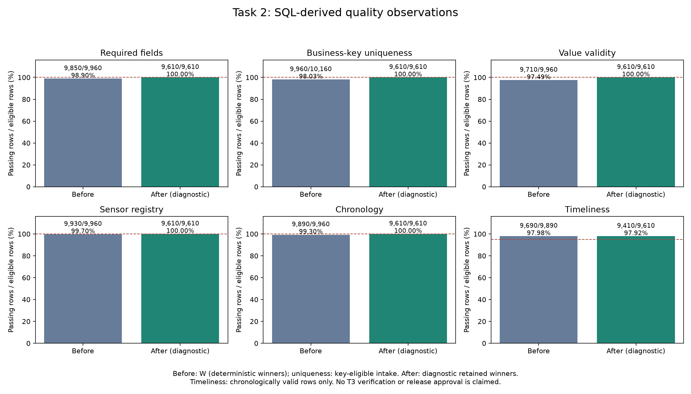

# Kết quả Task 2 — Profile and measure quality

Dữ liệu synthetic được kiểm tra với `trusted_manifest.json` được cung cấp riêng. Bản chạy này chỉ đo chất lượng từ input đã cung cấp; chưa duyệt phát hành dữ liệu.

Snapshot, envelopes và inventory nằm trong chính thư mục kết quả này. Contract đã được chụp và băm trước khi đo. Chưa có thành viên thứ hai ký review; trạng thái PENDING_INDEPENDENT_REVIEW được giữ nguyên, không tự nhận đã hoàn tất.

## Task 2: quần thể và kết quả

- Raw: **10,205** bản ghi vật lý.
- Parse lỗi: **5**; bị loại trước dedup vì KEY/INGEST_PARSE: **40** (hợp của hai lỗi, không cộng trùng).
- Key-eligible: **10,160**; phiên bản thừa: **200**.
- W: **9,960** winners, được chọn trước lọc validity.
- Required-field failures trong parsed intake: **130/10,200**.

| Giai đoạn | Rule | Tử số | Mẫu số | Giá trị | Ngưỡng | Trạng thái | Loại khỏi mẫu số |
|---|---|---:|---:|---:|---:|---|---:|
| before | Q_REQUIRED | 9,850 | 9,960 | 98.8956% | 100% | FAIL | 0 |
| before | Q_SENSOR | 9,930 | 9,960 | 99.6988% | 100% | FAIL | 0 |
| before | Q_TIME | 9,890 | 9,960 | 99.2972% | 100% | FAIL | 0 |
| before | Q_TIMELY | 9,690 | 9,890 | 97.9778% | 95% | PASS | 70 |
| before | Q_UNIQUE | 9,960 | 10,160 | 98.0315% | 100% | FAIL | 0 |
| before | Q_VALUE | 9,710 | 9,960 | 97.4900% | 100% | FAIL | 0 |
| after_diagnostic | Q_QA_AGREEMENT | 95 | 100 | 95.0000% | 95% | PASS | 0 |
| after_diagnostic | Q_QA_COVERAGE | 100 | 100 | 100.0000% | 100% | PASS | 0 |
| after_diagnostic | Q_REQUIRED | 9,610 | 9,610 | 100.0000% | 100% | PASS | 0 |
| after_diagnostic | Q_SENSOR | 9,610 | 9,610 | 100.0000% | 100% | PASS | 0 |
| after_diagnostic | Q_TIME | 9,610 | 9,610 | 100.0000% | 100% | PASS | 0 |
| after_diagnostic | Q_TIMELY | 9,410 | 9,610 | 97.9188% | 95% | PASS | 0 |
| after_diagnostic | Q_UNIQUE | 9,610 | 9,610 | 100.0000% | 100% | PASS | 0 |
| after_diagnostic | Q_VALUE | 9,610 | 9,610 | 100.0000% | 100% | PASS | 0 |

Before completeness/value/registry/chronology dùng toàn bộ W. Uniqueness before dùng key-eligible trước dedup. Timeliness chỉ dùng các hàng có chronology hợp lệ. NULL là thất bại; mẫu số 0 có giá trị null và NOT_EVALUATED.

After là phép chiếu chẩn đoán của các winners hợp lệ trong SQL, có làm tròn DECIMAL(8,2) khi so với QA; chưa phải kết quả kiểm chứng Task 3. Không xuất Parquet, quarantine ledger, duplicate ledger hay manifest phát hành. Sau Task 3 cần tính lại trên candidate thực tế.

Giữ lại chẩn đoán **9,610/10,205 (94.17%)** so với raw; **9,610/9,960 (96.49%)** so với W. Winners không đạt validity: **350**. Raw ngoài tập giữ lại: **595**, gồm parse/key failures, superseded versions và winners không hợp lệ. Còn **200** hàng trễ được giữ lại.

Completeness tăng sau lọc vì các hàng lỗi bị loại khỏi quần thể, không phải vì giá trị thiếu đã được phục hồi. QA agreement chỉ mô tả mẫu tham chiếu được cung cấp; coverage được đo riêng trên toàn bộ 100 IDs. Không dùng QA để sửa hay chọn phép đo.

## Điều tra lỗi

Các nhóm sau có thể chồng lấp. Source references và tối đa 3 ví dụ/nhóm nằm trong `defect_investigation.json`; không đưa email hay raw payload vào báo cáo.

- **INGEST_PARSE: 20** (parsed intake before dedup). Arrival time không đúng UTC format hoặc không parse được; không thể dùng để chọn winner. Ví dụ: observations_a.csv:361; observations_a.csv:362; observations_a.csv:363.
- **KEY: 20** (parsed intake before dedup). ID thiếu/sai mẫu R[0-9]{6}; loại trước khi xếp hạng. Ví dụ: observations_a.csv:341; observations_a.csv:342; observations_a.csv:343.
- **LATE: 200** (chronologically valid W). Chronology hợp lệ nhưng lag > 900 giây; vẫn giữ nếu các điều kiện khác hợp lệ. Ví dụ: observations_a.csv:381; observations_a.csv:382; observations_a.csv:383.
- **NUMERIC: 170** (W). Reading không chuyển thành số hữu hạn, bao gồm NULL/NaN/Infinity. Ví dụ: observations_a.csv:1; observations_a.csv:2; observations_a.csv:3.
- **PARSE: 5** (raw intake). JSON không parse được vẫn có envelope và source_row, không bị bỏ qua. Ví dụ: observations_b.jsonl:5201; observations_b.jsonl:5202; observations_b.jsonl:5203.
- **REFERENCE: 30** (W sensor registry check). Sensor không nằm trong registry; đây không phải QA disagreement. Ví dụ: observations_a.csv:311; observations_a.csv:312; observations_a.csv:313.
- **REQUIRED: 110** (W). Một hay nhiều trường bắt buộc rỗng; email là tùy chọn nên không tham gia. Ví dụ: observations_a.csv:1; observations_a.csv:2; observations_a.csv:3.
- **SUPERSEDED: 200** (key_eligible). Phiên bản thừa theo thứ tự ingest giảm dần, source_object và source_row tăng dần. Ví dụ: observations_a.csv:1001; observations_a.csv:1002; observations_a.csv:1003.
- **TIME: 70** (W). Event/ingest không parse được hoặc sai thứ tự/cutoff AS_OF. Ví dụ: observations_a.csv:241; observations_a.csv:242; observations_a.csv:243.
- **UNIT: 40** (W). Unit thiếu hoặc khác C/F; không mặc định thành Celsius. Ví dụ: observations_a.csv:161; observations_a.csv:162; observations_a.csv:163.
- **VALUE: 250** (W). Không finite/không đổi đơn vị được hoặc ngoài [-30,60] trước khi làm tròn. Ví dụ: observations_a.csv:1; observations_a.csv:2; observations_a.csv:3.

## Môi trường và giới hạn

Python 3.14.7; DuckDB 1.4.4. Phiên bản đầy đủ: `runtime-versions.json`.
Bài yêu cầu Python 3.11 và image được chuẩn bị trước. Máy local đang dùng Python 3.14; không có image digest Kubernetes để xác minh. Snapshot, envelopes và database chứa dữ liệu restricted; không đưa vào analyst release. Local folder không chứng minh chính sách quyền truy cập S3.
